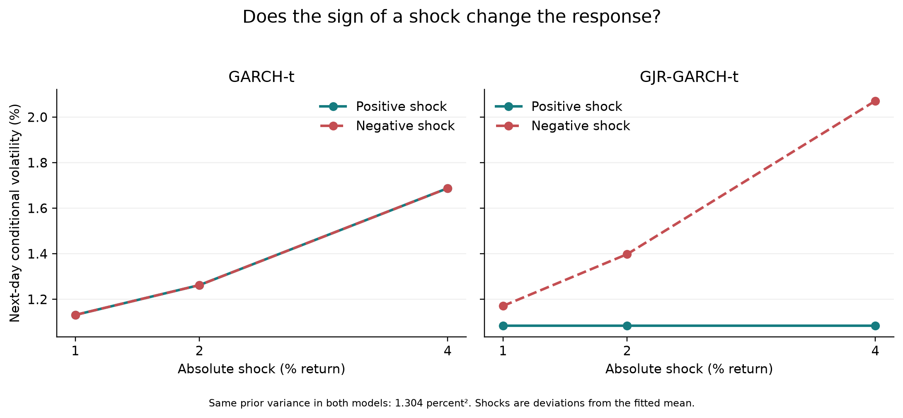
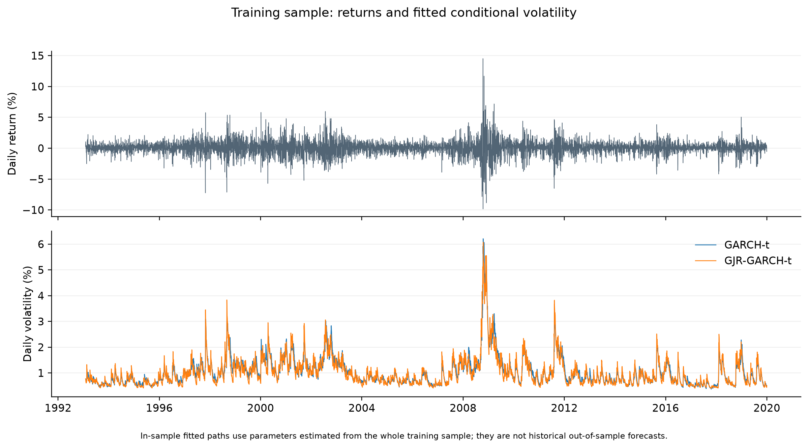

# What does GARCH actually learn about volatility?

*Predicting the Left Tail · Part 1 of 7*

A 4% rally and a 4% drop look identical once we square them. If we're holding the market, they feel quite different.

That is where this project starts. Can information available today help us predict unusually large downside movement over the next five trading days? And does machine learning add anything to a conventional volatility model?

Before comparing forecasts, I want to understand what those models measure. In this first part, we use daily SPY returns to explore ARCH, GARCH, and a version that lets negative surprises have a different effect. The accompanying notebook contains the calculations; this article follows the questions that made them interesting.

## Start with a return

SPY is an exchange-traded fund tracking the S&P 500. We use adjusted closing prices from Yahoo Finance, accessed through `yfinance`. Adjustments account for splits and dividends; we are not interpreting the mechanical price change at a distribution as an investment loss.

A simple daily return is:

$$
r_t = \frac{P_t}{P_{t-1}} - 1
$$

Here P is the adjusted price and t identifies the trading session. A move from 100 to 110 gives a return of 0.10, or 10%.

```python
# prices is a date-indexed Series of adjusted closing prices.
returns = prices.pct_change(fill_method=None)
```

The first return is undefined because there is no preceding price. We also check the trading calendar: a missing row can hide a skipped session without leaving a missing value in the file. We do not fill missing prices and quietly call the resulting change a one-day return.

Our snapshot has 8,464 SPY prices, from January 29, 1993 through September 15, 2026, giving 8,463 daily returns. Those price dates match every session in our XNYS calendar reference over that window.

We also downloaded VIX and VIX3M for later experiments. They are not inputs to these Part 1 fits. Comparing raw row counts was initially misleading: VIX contains empty rows on non-session dates and observations before our SPY sample. For a meaningful availability check, we align VIX to SPY's dates. Every SPY date has a nonmissing VIX close in this snapshot; the detailed notebook also reports extra source dates for investigation.

## From returns to variance

Now that we have daily returns, how do we describe how widely they vary? Their average tells us about their center, but it doesn't tell us how spread out they are.

One measure of that spread is **variance**: the expected squared distance from the mean. Let mu denote the expected return, so that mu = E[r]. Here E means expectation, or an average under the probability distribution. Assuming the second moment is finite, variance is defined as:

$$
\mathrm{Var}(r) = E[(r-\mu)^2]
$$

The subtraction centers each return on its mean. Why then square the difference? Deviations above and below the mean average to zero; squaring keeps them from cancelling and gives larger deviations more weight. A deviation of four percentage points contributes four times as much as a deviation of two percentage points. Absolute deviations would also measure spread, but they define a different quantity. ARCH and GARCH model variance.

That raises a question we'll need shortly: how does a squared deviation from the mean relate to a raw squared return?

Start by expanding the square:

$$
(r-\mu)^2 = r^2 - 2\mu r + \mu^2
$$

Take the expectation of each term. Because mu is a constant, we can pull it outside the expectation, and the expectation of mu squared is just mu squared:

$$
\mathrm{Var}(r) = E[r^2] - 2\mu E[r] + \mu^2
$$

Now substitute E[r] = mu:

$$
\mathrm{Var}(r) = E[r^2] - 2\mu^2 + \mu^2 = E[r^2] - \mu^2
$$

Rearranging gives the connection:

$$
E[r^2] = \mathrm{Var}(r) + \mu^2
$$

This identity is exact; it does not require normally distributed returns. The expected squared return measures distance from zero, while variance measures distance from the mean. They are equal when the mean is zero. Approximating one by the other neglects mu squared; whether that is small enough depends on its size relative to the variance.

An individual squared return is still only one observation, not the variance itself. In our models, we estimate a mean and use the squared shocks around that mean. Keeping those quantities separate will help us understand what the models are learning.

## A short detour: the loss after a round trip

Suppose we earn 10%, then lose 10%. Starting with 100, we finish with 99. The arithmetic average return is zero, but the compounded return is negative.

For equal and opposite simple returns, this is exact:

$$
(1+r)(1-r) = 1-r^2
$$

The second percentage change acts on a different balance. No normal distribution or stochastic process is needed to explain this example.

A related expression comes from approximating the log return for small r:

$$
\log(1+r) \approx r-\frac{r^2}{2}
$$

This is a second-order Taylor approximation, not an exact formula for an arbitrary finite return. Taking expectations introduces both variance and squared mean through the identity above. It helps explain the difference between arithmetic and compounded growth, but it is not the reason ARCH assumes that yesterday's squared shock predicts today's variance. That is a separate modeling assumption.

## ARCH: can a surprise tell us about the next one?

Write the return as a constant mean plus a shock:

$$
r_t = \mu + \epsilon_t, \qquad \epsilon_t = \sqrt{h_t}\,z_t
$$

The shock, epsilon, is the return minus the modeled expected return. The quantity h is conditional variance: variance given the information available before that return. The standardized innovation z has mean zero and variance one under our model assumptions. Volatility is the square root of h.

ARCH stands for autoregressive conditional heteroskedasticity. In plain language, it allows variance to change over time according to past shocks. ARCH(1) uses one lag:

$$
h_{t+1} = \omega + \alpha\epsilon_t^2
$$

Omega is a positive baseline term. Alpha is a nonnegative weight on the most recent squared shock. A bigger surprise raises the next variance estimate when alpha is positive.

Why square the shock? Because, under the conditional-mean assumption:

$$
E[\epsilon_t^2\mid\mathcal{F}_{t-1}] = h_t
$$

The symbol F represents information available at that time. A realized squared shock is a noisy observation of conditional variance. ARCH assumes its recent value helps predict the next variance. We still have to test whether that relationship forecasts well.

## GARCH: let the variance estimate carry forward

ARCH(1) responds only to the latest shock. GARCH(1,1) adds the previous variance estimate:

$$
h_{t+1} = \omega + \alpha\epsilon_t^2 + \beta h_t
$$

Beta carries the model's previous assessment forward. Alpha plus beta describes persistence in expected variance under the usual standardized-error assumptions. When this sum is below one, the model has a finite long-run variance under the standard conditions; values close to one imply slow reversion toward that level. These specifications are documented in the [arch package's variance-model reference](https://arch.readthedocs.io/en/latest/univariate/generated/arch.univariate.GARCH.html).

Our normal-error GARCH fit estimates alpha at about 0.109 and beta at 0.877, giving persistence of 0.986. That says the fitted model has substantial memory. It does not establish a permanent property of SPY or guarantee good future forecasts.

## What if extreme surprises are more common?

We fit both normal and Student-t innovations. The Student-t version allows heavier tails: more probability on large standardized surprises. Its degrees-of-freedom parameter, nu, controls the tail weight; smaller values imply heavier tails. The implementation standardizes the innovations to unit variance and requires nu above two. See the [arch Student-t specification](https://arch.readthedocs.io/en/latest/univariate/generated/arch.univariate.StudentsT.html).

Our GARCH-t fit estimates nu at approximately 5.87. This is a fitted distributional assumption about standardized shocks, not a claim that raw returns are independent draws from a single Student-t distribution.

## Does the sign of a shock matter?

Ordinary GARCH gives equal responses to equal-magnitude positive and negative shocks:

$$
(+0.04)^2 = (-0.04)^2 = 0.0016
$$

These are surprises relative to the mean, not necessarily raw returns. GJR-GARCH adds a term that switches on for negative shocks:

$$
h_{t+1} = \omega + \alpha\epsilon_t^2 + \gamma\epsilon_t^2 I(\epsilon_t<0) + \beta h_t
$$

The indicator I is one when the shock is negative and zero otherwise. Positive shocks receive weight alpha; negative shocks receive alpha plus gamma. Gamma describes asymmetry; the equation alone does not explain its economic cause. The [arch modeling examples](https://arch.readthedocs.io/en/latest/univariate/univariate_volatility_modeling.html) show this specification and its implementation.

Here is the core fit. Returns are converted from decimals to percentage points so that a 1% return becomes 1.0. The resulting conditional variance is in percentage-points squared.

```python
from arch import arch_model

train = returns.loc[:"2019-12-31"].iloc[1:]
assert train.notna().all()  # Investigate gaps; don't silently discard them.

fit = arch_model(
    100 * train,
    mean="Constant",
    vol="GARCH", p=1, o=1, q=1,
    dist="StudentsT",
    rescale=False,
).fit(disp="off", options={"maxiter": 2000})
```

This snippet assumes `returns` still includes the first undefined return from the earlier calculation. The repository's tested helper performs the full validation and fitting workflow.

## What did we actually fit?

All four models use the same **6,779 training returns**, from February 1, 1993 through December 31, 2019. We reserve **1,684 later returns**, from January 2, 2020 through September 15, 2026. We have inspected data coverage, but have not evaluated forecast performance on that later period.

| Model | Estimated parameters | Persistence | In-sample AIC |
|---|---:|---:|---:|
| ARCH(1), normal errors | 3 | 0.3985 | 20,178.56 |
| GARCH(1,1), normal errors | 4 | 0.9861 | 18,085.58 |
| GARCH, Student-t errors | 5 | 0.9977 | 17,739.44 |
| GJR-GARCH, Student-t errors | 6 | 0.9874 | 17,539.36 |

Parameter counts include the estimated mean and, where applicable, Student-t degrees of freedom. For GJR with symmetric standardized innovations, persistence includes half of gamma in addition to alpha and beta. AIC is a likelihood-based measure of fit with a penalty for parameter count; lower is better on this common training sample. It is not a measure of trading profitability or held-out forecast accuracy.

Several thousand observations give us a substantial history relative to three to six parameters. That is context, not a minimum-sample rule: dependence, changing market conditions, and the number of large shocks also affect how much we can learn.

All four saved fits report successful optimizer convergence with no captured warnings. GJR's alpha lands at its zero boundary, while gamma is approximately 0.195 and beta approximately 0.890. In this fit, negative shocks drive the immediate shock response. The boundary estimate deserves scrutiny; it does not prove that positive surprises never matter.



*We apply shocks of ±1, ±2, and ±4 percentage points around the modeled mean, holding previous variance fixed at 1.304 percentage-points squared—the training sample variance. This controlled comparison isolates the fitted response; it is not an observed market event or a backtest.*



*These paths use parameters estimated from the entire training period. They illustrate the fit, but were not forecasts available at each historical date and must not be used as such in later ML experiments.*

## The question we still haven't answered

A conditional variance forecast describes variation around a mean. Our proposed target counts negative raw returns over the next five trading days:

$$
\mathrm{DSV}_{t,t+5} = \sum_{i=1}^{5} r_{t+i}^2 I(r_{t+i}<0)
$$

This downside realized variance is a zero-threshold squared-loss measure. Positive days contribute zero. It is neither the week's net loss nor its maximum drawdown, and it discards the order of losses within the window. It counts ordinary negative days as well as extreme ones.

Adding asymmetry to GARCH does not automatically turn its total-variance forecast into this downside forecast. Part 2 will work through that relationship, define the target carefully, and begin walk-forward evaluation: predicting using only information available at each forecast date.

For now, we have fitted models that remember shocks and can distinguish their signs. Whether that helps predict the downside remains an open question.

## Run the accompanying work

The [repository instructions](../README.md#prepare-the-data-and-run-part-1) describe Python 3.11.14, locked dependencies, data preparation, tests, and the [Part 1 notebook](../notebooks/01_garch_foundations.ipynb). After environment setup, run these from the project root:

```sh
python scripts/download_data.py
python -m pytest
python scripts/run_garch.py
```

The scripts record data checksums and reuse the local snapshot. **Reproducibility limitation:** a fresh provider download may differ from our original inputs. This draft shares the code, reference estimates, and source manifest; a publicly obtainable frozen snapshot and its reference-verification workflow are still pending. We cannot yet promise that a fresh checkout will produce identical estimates. Numerical fitting can also vary slightly across platforms.

[Series guide](SERIES.md) · Next: Defining and forecasting downside risk (in preparation)
